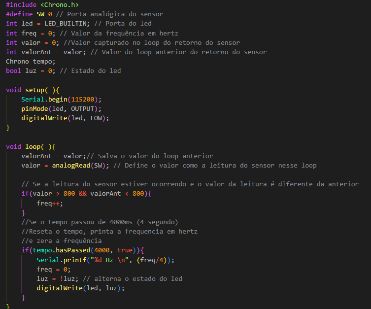
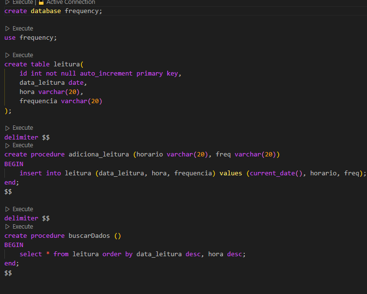
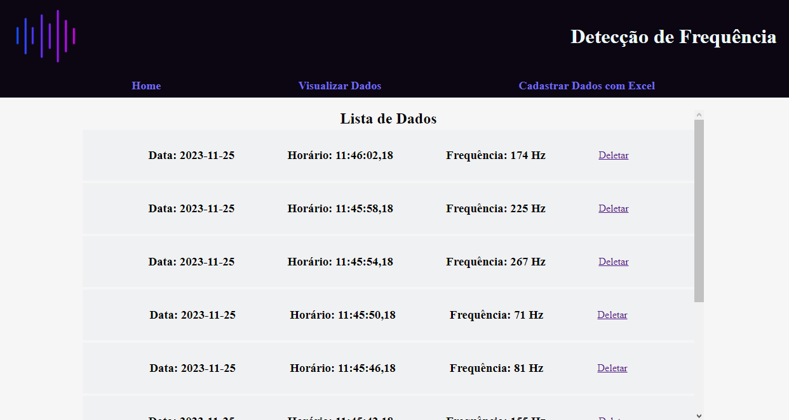

# Projeto Integrador 2º Semestre

No segundo semestre, foi proposto que os alunos fizessem um projeto de IOT utilizando a placa microcontroladora ESP8266 e o uso de um sensor para detectar algum aspecto físico do ambiente, como sons, umidade, entre outros e salvar os dados obtidos em um banco de dados.

## Sensor de Vibrações

Meu grupo comprou o sensor SW-420, que é capaz de detectar vibrações, para usá-lo no nosso projeto, que tem o objetivo de detectar vibrações em máquinas.

## Banco de dados

Nosso banco de dados é bem simples, com apenas uma tabela que guarda a data, hora e o valor da frequência lida.

## Site

Foi necessária a criação de um site para cadastrar e exibir os dados.

## Como Abrir o Projeto em Seu Computador

Para rodar este projeto, é necessário abrir a pasta PI como um projeto do NetBeans, a IDE irá dizer que você ainda não tem um servidor tomcat selecionado para abrir esse projeto, nem a biblioteca do mysql connector, mas eles já estão na raiz do repositório do github, então basta selecioná-los.
